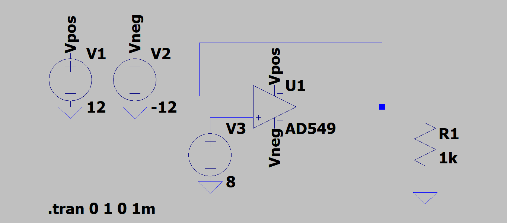
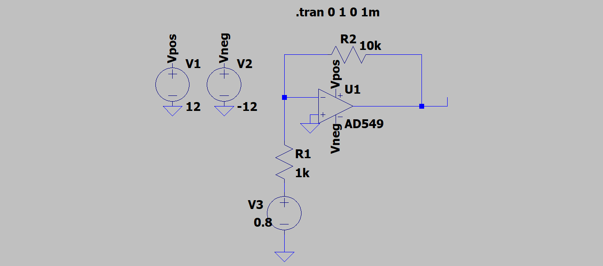
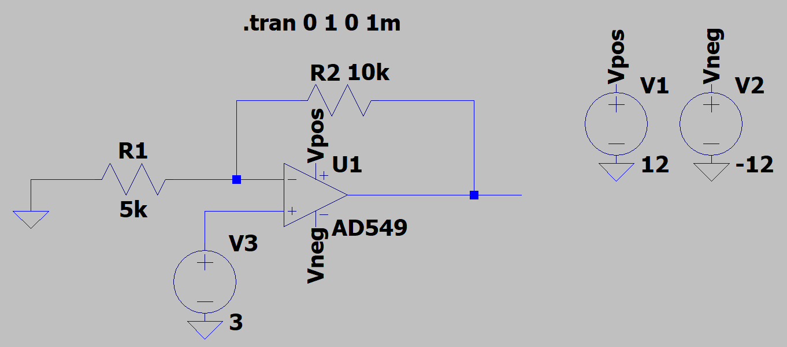
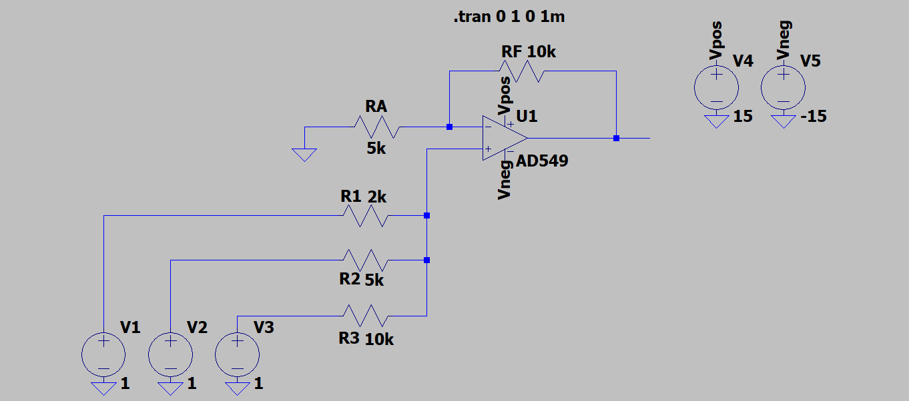

# Atividade 2
Aluno: 
* Gabriel Wagner - <gabrielstd545@gmail.com>

Professores: 
* Daniel Lohmann

## Exercício 1

### Amplificadores Operacionais
Os amplificadores operacionais são circuitos integrados capazes de realizar várias diversas funções, medição de tensões com isolamento elétrico, amplificação de sinais e operações aritméticas. O ampop oferece muitas outras opções dependendo do circuito empregado.
Seus terminais são: Entrada inversora, entrada não inversora, terminais de alimentação e saída.

### Ampop Ideal
Figura 1 - Ampop Ideal

Referência: http://intranet.deei.fct.ualg.pt/AC/Sebenta_Online/www.isr.uc.pt/~paulino/cse/Sebenta_Online/cap_15/ampopid.htm

No ampop ideal as impedâncias de entrada são infinitas, ou seja, não entram correntes no ampop pelas entradas inversora e não inversora.
A impedância de saída é igual a zero. Isso significa que toda tensão da saída será aproveitada por uma provável carga.
O ganho do ampop ideal é infinito. Tomando pela equação do ampop ideal (V0 = A*(V+ - V_)), qualquer diferença de tensão entre as entradas inversora e não inversora resultará em uma tensão infinita na saída.

### Malha aberta
A malha aberta é uma configuração onde o ampop não apresenta realimentação, tanto positiva quanto negativa. O ganho nessa configuração apresenta um valor muito alto, por vezes maior que 10000 V/V.

### Malha fechada
A malha fechada é uma configuração onde o ampop apresenta realimentação, usualmente negativa. O ganho nessa configuração apresenta valores menores que em malha aberta.

### Cálculo de malha fechada

### Buffer

Figura 2 - Buffer

O buffer é uma implementação do ampop onde a tensão de entrada será a mesma tensão na saida. Muito utilizado quando você quer saber a tensão em uma parte do circuito, por exemplo em um resistor shunt, verificando assim a corrente naquela parte do circuito. A utilização do buffer para medição de tensão é muito interessante pois o ampop faz um isolamento elétrico entre ampop e circuito, pois a impedância de entrada do ampop é muito alta.

### Amplificador Inversor

Figura 3 - Inversor

O amplificador inversor tem a função de amplificar ou atenuar o sinal de entrada, jogando uma tensão com sinal contrário na saída.

Vout = Ganho * Vin

Sendo o Ganho = -R2/R1, lembrando que R2 é o resistor na realimentação e R1 o resistor da tensão de entrada.

### Amplificador Não Inversor

Figura 4 - Não Inversor

O amplificador não inversor tem a função de amplificar ou atenuar o sinal de entrada, jogando uma tensão com o mesmo sinal na saída.

Vout = Ganho * Vin

Sendo o Ganho = 1 + (R2/R1), lembrando que R2 é o resistor na realimentação e R1 o resistor ligado ao terra.

### Amplificador Somador Inversor

Figura 5 - Somador Inversor

O amplificador somador inversor faz os somatórios das tensões que entram no terminal inversor, e libera esse resultado na saída.
O somador inversor segue a seguinte equação.

Vout = -RF * (V1/R1 + V2/R2 + V3/R3 ... Vn/Rn)

Conforme você vai adicionando mais sinais, a equação aumenta até n fontes e por conseguinte n resistores. 

### Amplificador Somador Não Inversor

Figura 6 - Somador Não Inversor

O amplificador somador não inversor faz os somatórios das tensões que entram no terminal não inversor, e libera esse resultado na saída.
O somador não inversor segue a seguinte equação.

Vout = (1 + RF/RA) * (V1/R1 + V2/R2 + V3/R3 ... Vn/Rn)

Conforme você vai adicionando mais sinais, a equação aumenta até n fontes e por conseguinte n resistores. 

### Subtrator

Figura 7 - Subtrator

O somador subtrator subtrai os sinais que entram nas saídas inversora e não inversora e joga essa tensão na saída.
O somador subtrator segue a seguinte equação.

Vout = V1*(R4*(R1+R2))/(R1*((R3+R4)) - V3*

### Amplificador de Instrumentação

