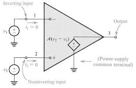

# Amplificador Operacional

Também chamado de AmpOp, é um dispositivo eletrônico alimentado por fonte de corrente contínua, na maioria da vezes simétrica, e que possuí dois terminais de entrada e 1 terminal de saída.  

É construido para comparar a diferença dos sinais de entrada e atruibuir a essa um multiplicador chamado de ganho. O resultado dessas operações é disponibilizado na saída do Ampop.

## AmpOp ideal

Modelo mais simplificado do Ampop, onde temos uma relação linear entre a diferença das entredas e a saída:

    Vout = Av . (v+ - V-)

Vout - tensão da saída

Av - Ganho em Malha aberta 

v+ - tensão na entrada não-inversora

v- - tensão na entrada inversora

Para o ampop ideal consideramos que o ganho de Malha aberta tende ao infinito, o que implica v+ = v- (ganho de modo comum nulo). Também consideramos que a impedância de entrada tende ao infinito (não há correntes de entrada) e a de saída é nula.

## Malha aberta e Malha Fechada

Malha fechada é quando temos uma realimentação da saída na entrada (ganho G), caso não exista a Malha é dita aberta (ganho Av).

Ganho em Malha Fechada:

    G = Vout/Vin

### Cálculo do ganho em Malha Fechada

Para obter a relação entrada-saída podemos aplicar lei de kirchhoff das correntes, e percorrer a malha. Esse exemplo mostra como obter o ganho de um Ampop inversor:

### Ganho finito de Malha aberta (Av)

Ao considerarmos um ganho finito não podemos considerar que V+ = V-, então por exemplo o ganho do AmpOp não-inversor se torna:

Se Av tende ao infinito voltamos ao ganho:

    G = 1 + R2/R1

Também para o AmpOp inversor o ganho é alterado:

Influência do ganho de Malha Aberta finito para ganhos em Malha Fechada:

Modelo       | Ganho Ideal (v/v)  | Ganho Av  (dB) | Ganho M.F. (v/v)  | Erro  
:-----------:| :-----------------:|:--------------:| :----------------:|:-------:
Não Inversor |  10                | 20             |  5                | 50 %
Inversor     | -10                | 20             | -4,76             | 52,4 %
Não Inversor |  1000              | 20             |  9,9              | 10001 %
Inversor     | -1000              | 20             | -9,9              | 10001 %
Não Inversor |  10                | 120            |  9,9999           | 0,001 %
Inversor     | -10                | 120            | -9,9999           | 0,001 %
Não Inversor |  1000              | 120            |  999              | 0,1 %
Inversor     | -1000              | 120            | -999              | 0,1 %

## Topologias de AmpOps :

+ Seguidor de Tensão
    - Elevada impedância de entrada, idealmente infinita
    - Baixa impedância de saída, idealmente nula
    - Saída igual a entrada, ganho unitário.
    
    G = 1

+ Amplificador Inversor
    - Ganho negativo.

    G = - R2/R1

+ Amplificador Não Inversor
    - Ganho positivo.

    G = (R1 + R2)/R1

+ Amplificador Somador Inversor
    - Saída é o valor inverso da soma ponderada das entradas

    Vout = - Rf (V1/R1 + V2/R2 + ... + Vn/Rn)

+ Amplificador Somador Não Inversor
    - Saída corresponde a soma ponderada das entradas
    - Caso os valores de resistores sejam iguais temos:

    Vout = [1/(n + 1)] (V1 + V2 + ... + Vn)

+ Amplificador Subtrator
    - Baixa impedância de entrada
    - Saída corresponde a subtração das entradas
    - Caso os valores de resistores sejam iguais temos:

    Vout = V2 - V1

+ Amplificador de Instrumentação
    - Um circuito que funciona como um Subtrator mas com elevada impedância
    - É possivel controlar o ganho alterando o valor de apenas um único resistor  

## Tensão de modo comum

oq é

considerando um amplificador subtrator com ganho 1000, usar um ex com 1% e 5% de erro nos resistores

## CMRR

É a razão de rejeição de modo comum, pode ser utilizada para medir a eficácia de um amplificador subtrator e é definida como:

    CMRR = 20log (Ad/Acm)

impacto do erro dos resistores no CMRR usando como exemplo o ampop subtator anterior

## Limitações de tensão de entrada e saída

AmpOp Rail-to-rail

## Tensão de *offset*

É uma  tensão que surge devido a um desequilíbrio CC, ela pode ser medida ao observar a saída do AmpOp ao anularmos as entradas. 

Para minimizar o efeito da tensão de *offset* é possivel adicionar a entrada do AmpOp uma fonte de mesmo valor mas polaridade oposta a tensão de *offset*.   

variação com a temperatura

## Correntes de polarização

como minimizar, circuitos para mitigar e aproximaçoes

corrente de offset